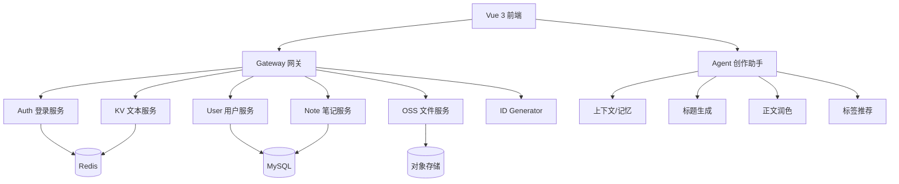

# 小哈书

<p align="center">
  <b>一个适合面试展示、学习 Spring Cloud Alibaba 和 AI Agent 的仿小红书微服务项目</b>
</p>

<p align="center">
  
  
  
  
  
</p>

> 小哈书不是工业级大项目，而是一个**能跑、能演示、能写进简历、能继续扩展 AI 能力**的内容社区实战项目。

---

## 一句话亮点

- 仿小红书内容社区
- Spring Cloud Alibaba 微服务拆分
- Sa-Token 鉴权登录
- Redis 验证码与会话
- OSS 文件上传
- 分布式 ID 生成
- Vue 3 小红书风格前端
- AI 创作助手：标题生成 / 正文润色 / 标签推荐 / 上下文记忆

---

## 为什么值得收藏

这个仓库适合收藏，不是因为它“最复杂”，而是因为它**最适合学习和面试演示**：

- 业务场景明确，容易讲
- 模块拆分清晰，容易学
- 前后端完整，容易跑
- Agent 能力接入，容易做亮点
- README 已尽量做成“打开就知道能干什么”的首页

---

## 项目架构



---

## 项目演示

> 后续建议补充真实截图或 GIF 动图，这里是最容易涨 Star 的地方。

| 首页 | 登录 | 发布笔记 | AI 助手 |
|---|---|---|---|
| 待补充截图 | 待补充截图 | 待补充截图 | 待补充截图 |

建议后续补的图片：
- `docs/screenshots/home.png`
- `docs/screenshots/login.png`
- `docs/screenshots/publish.png`
- `docs/screenshots/agent.png`

---

## 适合谁

- 想找 Java 后端工作的人
- 想练 Spring Cloud Alibaba 微服务的人
- 想做一个简历能写的项目的人
- 想把 Agent / AI 开发方向加到项目里的人

---

## 技术栈

### 后端
- Spring Boot 3
- Spring Cloud Alibaba
- Nacos
- OpenFeign
- Sa-Token
- MyBatis
- Redis
- MySQL
- OSS / MinIO
- Maven 多模块

### 前端
- Vue 3
- Vite
- Axios
- 仿小红书移动端风格

### AI / Agent
- 独立 `xiaohashu-agent` 服务
- 会话上下文 `sessionId`
- 轻量记忆体
- 上下文提示
- 幻觉抑制思路
- 可平滑升级为 LangGraph / RAG / LLM Tool Calling

---

## 项目模块

- `xiaohashu-auth`：认证、登录、验证码
- `xiaohashu-user`：用户资料、权限、角色
- `xiaohashu-note`：笔记发布与内容管理
- `xiaohashu-oss`：文件上传与对象存储
- `xiaohashu-kv`：笔记正文等长文本存储
- `xiaohashu-distribute-id-generator`：分布式 ID 生成
- `xiaohashu-gateway`：统一网关与鉴权
- `xiaoha-framework`：公共基础组件
- `xiaohashu-web`：Vue 3 前端测试页面
- `xiaohashu-agent`：AI 创作助手服务

---

## 核心功能

### 用户侧
- 手机号注册
- 验证码登录
- 密码登录
- 修改密码
- 修改个人资料

### 内容侧
- 发布图文笔记
- 发布视频笔记
- 笔记正文存储与恢复
- 文件上传

### AI 创作助手
- 生成标题
- 润色正文
- 推荐标签
- 根据 `sessionId` 保存记忆
- 根据偏好和内容生成上下文提示

---

## 推荐测试流程

### 后端 API
1. 发送验证码
2. 注册用户
3. 查询手机号
4. 验证码登录
5. 密码登录
6. 发布笔记
7. Agent 一键生成

### 前端页面
1. 首页信息流
2. 登录页
3. 注册页
4. 发布页
5. AI 助手页
6. 个人主页

---

## 快速启动

### 1）前端

```bash
cd xiaohashu-web
npm install
npm run dev
```

### 2）Agent 服务

```bash
mvn -pl xiaohashu-agent spring-boot:run
```

### 3）后端主项目

先确保以下服务可用：
- Nacos
- Redis
- MySQL
- 网关
- auth / user / note / oss / kv / id-generator

---

## Postman 说明

### 通用环境变量
- `base_url`
- `token`

### 常见请求头

```http
Authorization: Bearer {{token}}
```

---

## Agent 接口

- `POST /agent/title`
- `POST /agent/rewrite`
- `POST /agent/tags`
- `POST /agent/run`

### 一键生成示例

```json
{
  "content": "今天分享一套通勤穿搭，适合上班和约会。",
  "sessionId": "demo-session-001",
  "preferences": "种草风, 干货风"
}
```

---

## Agent 设计思路

当前 Agent 采用“轻量工业化”思路：

1. 先分析上下文
2. 再生成标题 / 润色 / 标签
3. 再写入记忆
4. 再输出记忆摘要

这样做的好处是：
- 能演示 AI 工程思路
- 便于以后升级成 LangGraph
- 便于以后接真实大模型和 RAG

---

## 简历可写亮点

- 基于 Spring Cloud Alibaba 拆分内容社区微服务
- 使用 Redis 实现验证码与会话增强
- 使用 OSS 完成图片/文件上传链路
- 使用分布式 ID 生成器支持主键统一生成
- 设计 AI 创作助手模块，支持上下文、记忆和标签推荐
- 实现 Vue 3 仿小红书前端演示页

---

## 项目定位

这个项目的目标不是工业级，而是：
- 能跑
- 能展示
- 能讲清楚架构
- 能体现后端、前端、AI 三个方向的能力
- 能成为你简历里的一个亮点项目

---

## Star 友好说明

如果你觉得这个项目对你有帮助，欢迎点个 Star。后续我会持续补充：

- 更完整的页面演示
- 更强的 Agent 能力
- 更清晰的架构说明
- 更适合面试展示的项目亮点

---

## 贡献与支持

如果你想参与或给建议，可以：

- 提 issue
- 提 PR
- 分享给想做项目的朋友
- 收藏本仓库，后续继续跟进更新
