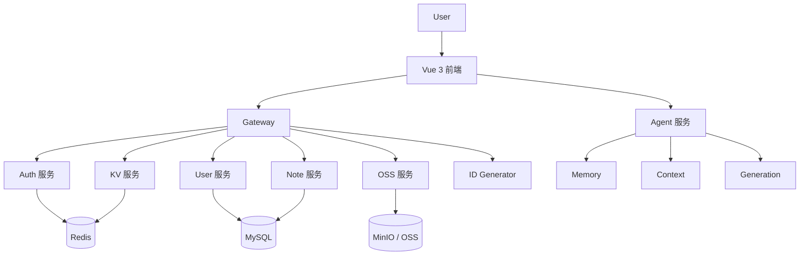

# 小哈书架构说明

## 总体架构

## 设计目标

- 用最小成本实现一个可演示的内容社区项目
- 通过微服务拆分体现工程能力
- 通过 AI Agent 体现 AI 开发方向
- 通过前端页面提升演示效果

## Agent 处理链路

1. 接收 `content`、`sessionId`、`preferences`
2. 构建上下文提示
3. 生成标题 / 润色 / 标签
4. 写入记忆
5. 输出记忆摘要

## 后续可升级方向

- 接入真实 LLM
- 接入 RAG
- 接入 LangGraph 工作流
- 接入持久化记忆存储
